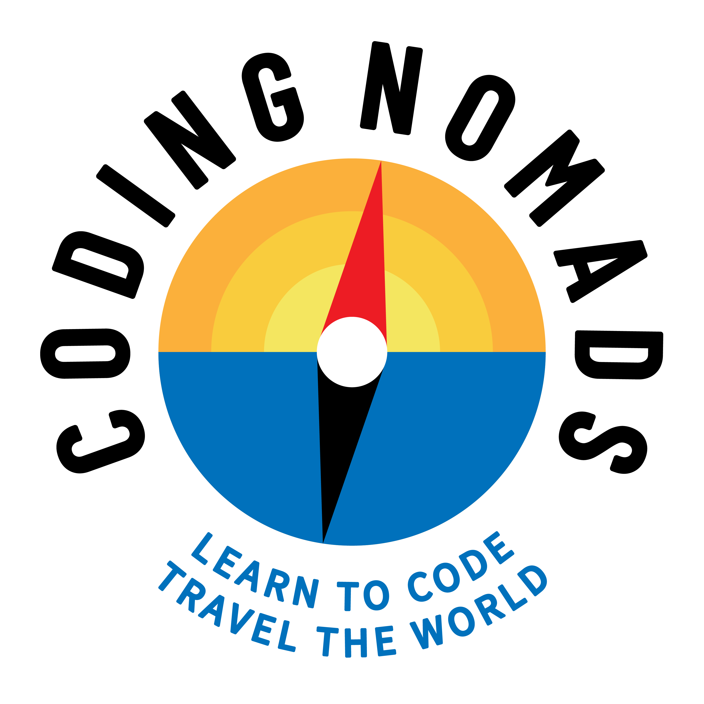

# Python Online Course

Here you can find the labs and project instructions, as well as solutions
for the CodingNomads 6 weeks online python course.

Please refer to the [Course Overview](https://codingnomads.atlassian.net/wiki/spaces/PYO/pages/415268966/Course+Overview) for the glue that ties all this together :)

---

### Clone Me!
From your CLI, in the directory where you wish to store the labs on your computer run: "git clone https://github.com/rdesmond/python_online"

### Contributing

There is always room for improvement for our material, and as a budding
software developer, learning to contribute to a project is a great first
step e.g. to get into open-source. Therefore remember:

**We appreciate `pull` requests!**

If you don't yet know what that means, no worries! Either come back later,
or read the links below. Basically, it's easy:

If you **find a typo**, or a **mistake in the code** - or you **want to add an
exercise of your own for other students to learn from** - you can add
these improvements to the original repository.

Check out how to [create a branch](https://help.github.com/articles/creating-and-deleting-branches-within-your-repository/) and how to [create a pull request from
a fork](https://help.github.com/articles/creating-a-pull-request-from-a-fork/)

Keep learning! :)
